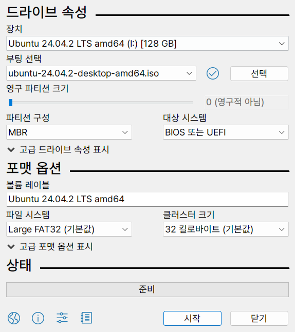
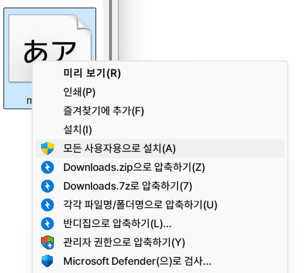
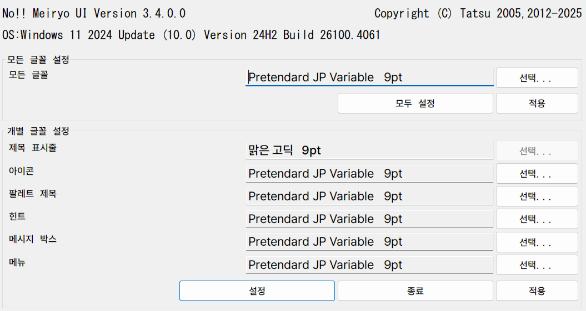

# no-malgun-gulim

윈도우11에서 맑은고딕 & 굴림과 이별하기

## 준비물

1. `C:\Windows\Fonts` 안의 글꼴을 삭제하기 위한 부팅 가능한 USB 메모리 (다이소산 OK)
2. [Ubuntu ISO](https://releases.ubuntu.com/noble/) + [Rufus](https://rufus.ie/ko/)
3. [MacType](https://github.com/snowie2000/mactype/releases)
4. [noMeiryoUI](https://github.com/Tatsu-syo/noMeiryoUI/releases)
5. [굴림+맑은고딕 개조 폰트](https://drive.google.com/drive/folders/17tJ91Atl2n6J1FX9ZUHBn0xEp3Tq4Zd7?usp=sharing) (출처: https://meeco.kr/Review/39555961)
6. [굴림 TTC 폰트](https://github.com/ubermenschjo/dotfiles/blob/master/.fonts/gulim.ttc)
7. 한글이 안 나와도 로그인할 수 있는 머슬 메모리

## 1. 굴림, 맑은고딕 삭제하기



위에서 Ubuntu ISO를 다운받아서 Rufus로 구워주고

우분투 설치 USB로 부팅, 설치 말고 Try Ubuntu를 선택한 후

파일 매니저를 열어서 윈도우 파티션을 마운트해줌.

이후 Terminal을 열어서 (Windows 이름은 파티션 이름에 따라 다를 수 있음)

```sh
sudo rm /media/ubuntu/Windows/Windows/Fonts/gulim.ttc
sudo rm /media/ubuntu/Windows/Windows/Fonts/malgun.ttf
sudo rm /media/ubuntu/Windows/Windows/Fonts/malgunbd.ttf
sudo rm /media/ubuntu/Windows/Windows/Fonts/malgunsl.ttf
```
윈도우의 맑은고딕, 굴림 파일을 삭제해 준다.

이후 재부팅.

## 2. 대체 글꼴 설치하기

위 4번의 `굴림+맑은고딕 개조 폰트` 에서 다운로드 받은

```
malgun.ttf
malgunbd.ttf
malgunsl.ttf
```

위 3개의 파일을 쉬프트 우클릭으로 설치.



## 3. 굴림 깔았다 지우기

위처럼 맑은고딕만 설치했을 경우 Win+R 누르고 글꼴 모양이 이상하게 나옴.

이를 해결하기 위해 위에서 다운받은 굴림 TTC 파일 (`gulim.ttc`)을 위와 같은 방법으로 다시 설치.

이후 레지스터리 편집기를 열어 (Win+R -> `regedit`)

```
HKEY_LOCAL_MACHINE\SOFTWARE\Microsoft\Windows NT\CurrentVersion\Fonts
```

이곳에 있는

```
Gulim & GulimChe & Dotum & DotumChe (TrueType)
```
```
굴림 & 굴림체 & 돋움 & 돋움체 (TrueType)
```

두 REG_SZ 레지스터리 값을 ""로 설정 (내용 없음)

이후 탐색기에
```
C:\Windows\Fonts
```
경로를 입력 후 굴림 글꼴 삭제. (안될 시에는 우분투 설치 USB로 부팅해서 지우는 걸 권장.)

이후 재부팅 한번.

## 4. MacType 깔기

맨 위 링크로 MacType을 깐 다음에 
```
C:\Program Files\MacType\ini
```
에 적당히 검색해서 다운받은 ini나 이 레포의 `PretendardJP.ini` 같은 것을 넣어서 적용하기.

## 5. noMeiryoUI 적용



**관리자 권한으로 실행**해서 모든 글꼴 부분을 선택한 후 `Pretendard JP Medium` 같은 것 선택 -> 모두 설정 -> 종료.


하면 좀 불편함은 있지만 완성